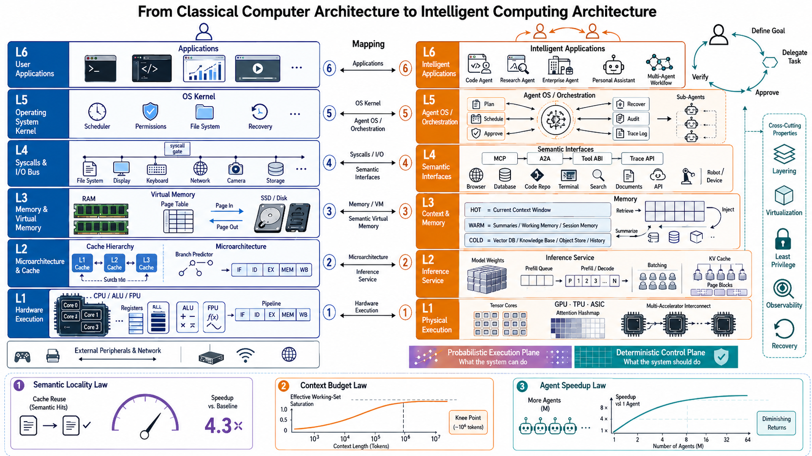
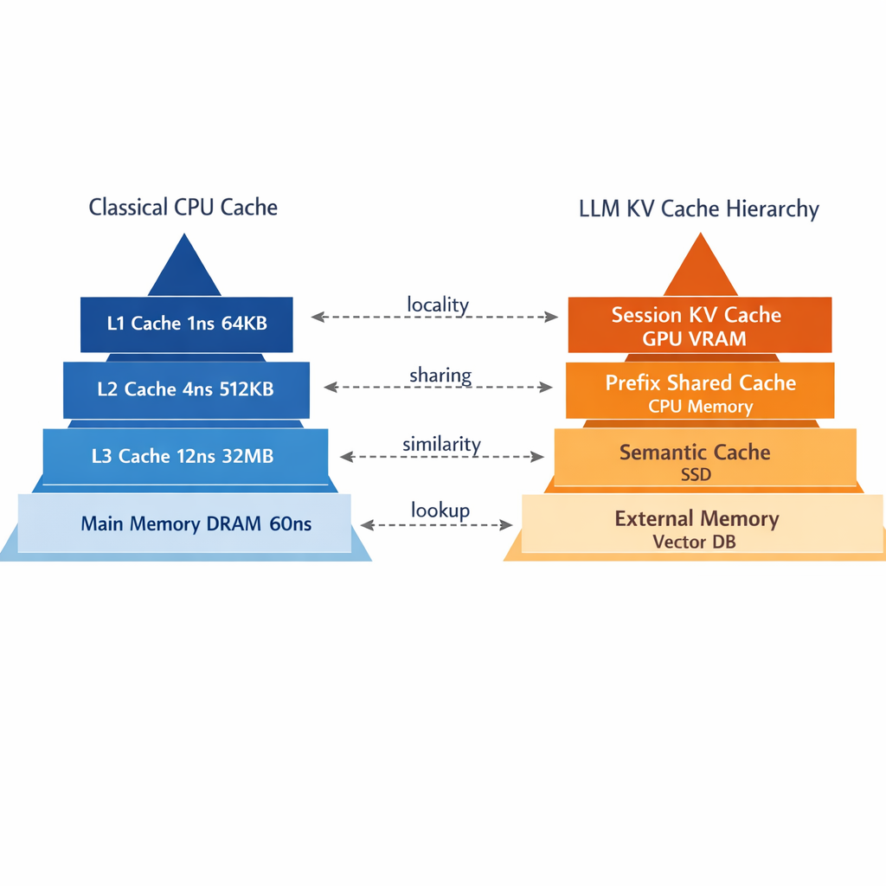

# Model-Native Computing Architecture
#### Envisioning Future System Architecture Through the Lens of Computer Architecture

> 📄 **arXiv:** <https://arxiv.org/abs/2606.00288>
>
> 📖 **Read the paper (PDF):**
> [English](https://github.com/ngyygm/llm-computer/raw/master/paper/paper_en_compressed.pdf) ·
> [中文](https://github.com/ngyygm/llm-computer/raw/master/paper/paper_zh_compressed.pdf)

**[中文版 README](README_CN.md)**

> A layered architecture framework for model-native computing systems — drawing systematic parallels between eight decades of classical computer architecture and the emerging AI/LLM ecosystem.

---

## Overview

Large language models are transitioning from a *model technology* to a *system technology*. When developers use Codex to write code or Claude Code to manage projects, the engineering challenges that surface — cache reuse, context capacity, agent scheduling, permission control — bear an unmistakable resemblance to classical computer-systems problems. This raises a natural question: if we treat the LLM as a CPU, the KV cache as a processor cache, the context window as main memory, and the agent framework as an operating system, can eight decades of computer-architecture wisdom guide the next generation of model-native computing systems?

This paper pursues that analogy as a **visionary survey** and proposes the **Intelligent Computing Architecture (ICA)** — a unified layered framework that gives model-native systems a shared vocabulary, explicit interface contracts, design axioms, and back-of-envelope design heuristics.

### Key Contributions

1. **Analogy framework** — a systematic mapping between classical computer architecture and the model-native stack, explicitly delineating where the analogy holds and where it breaks down.
2. **Dual-plane architecture** — resolving the enduring "is an LLM a CPU or an OS?" conflict by separating a *probabilistic execution plane* (what the system *can* do) from a *deterministic control plane* (what it *should* do).
3. **ICA six-layer model** — L1–L6, each with explicit inter-layer interface contracts and six design axioms.
4. **Three Amdahl-style design heuristics** — Semantic Locality, Context Budget, and Agent Speedup, transplanted from Amdahl's Law to give a previously qualitative design space computable, order-of-magnitude intuition (not validated scaling laws).
5. **Survey, paradigm mapping, and roadmap** — fifty years of CPU-evolution lessons mapped onto LLM/agent trajectories, a socio-technical analysis of the emerging "fabless AI" industry structure, and a decade-scale research roadmap.

## Architecture

### ICA Six-Layer Model

| Layer | Name | Classical Analogy |
|:-----:|------|-------------------|
| L6 | Workflow & Applications | User Applications |
| L5 | Agent Orchestration | Operating System |
| L4 | Tool & Protocol Interface | System Call / ABI |
| L3 | Context & Memory Management | Virtual Memory |
| L2 | Inference & KV Cache Serving | Instruction Pipeline / Cache |
| L1 | Model Weights & Hardware | CPU / Silicon |

### Dual-Plane Architecture

The framework decomposes the system into two orthogonal planes that form a **graded crossover around L3–L4** rather than a hard partition:

- **Probabilistic Execution Plane** (weighted toward L1–L3): model inference, KV cache, context management — *what the system CAN do*
- **Deterministic Control Plane** (weighted toward L4–L5): tool protocols, agent orchestration, governance — *what the system SHOULD do*

This reconciles prior single-plane proposals (ArbiterOS's "Probabilistic CPU", AIOS's "kernel", AgentOS's "reasoning kernel") as complementary views of the same two-plane system.

### Three Design Heuristics

These are deliberately framed as back-of-envelope *heuristics* (organizing models), not validated scaling laws:

| Heuristic | Formula | Classical Analogy |
|-----------|---------|-------------------|
| **I. Semantic Locality** | $S = \dfrac{1}{(1-H) + H \cdot \alpha^{-1}}$ | Amdahl's Law for cache hit ratios |
| **II. Context Budget** | $W_{\text{eff}} = C \cdot \bar{\beta} \le C$ | Working-set estimation |
| **III. Agent Speedup** | $S_{\text{agent}} = \dfrac{1}{(1-F) + \dfrac{F}{N \cdot E}}$ | Amdahl's Law for multi-agent |

## Figures

The paper is richly illustrated with TikZ-generated figures and diagrams. Key figures:

### Core Architecture

<p align="center">
  
  <br><em>Analogy mapping: classical computing ↔ model-native computing</em>
</p>

<p align="center">
  
  <br><em>Structural correspondence: CPU cache hierarchy ↔ LLM KV cache hierarchy</em>
</p>

### Agent Evolution

<p align="center">
  
  <br><em>Agent framework evolution timeline (Gen I → Gen V)</em>
</p>

### Additional Key Figures (LaTeX/TikZ)

| Figure | Description |
|--------|-------------|
| `fig_arch` | ICA six-layer architecture diagram |
| `fig_dual_plane` | Dual-plane architecture: probabilistic execution vs deterministic control |
| `fig_icam_crossmap` | Cross-mapping of ICA layers against the dual-plane architecture |
| `fig_law_curves` | Characteristic curves of the three design heuristics |
| `fig_gen_matrix` | Capability maturity matrix across five agent generations |
| `fig_gen_trajectory` | Trajectory of $F$, $E$, and $S_{\text{agent}}$ across generations |
| `fig_trilemma` | Latency–throughput–cost trilemma in LLM serving |
| `fig_beta_decay` | Attention retention rate $\beta(L)$: empirical U-shape vs exponential decay envelope |
| `fig_biglittle` | ARM big.LITTLE ↔ LLM model orchestration |
| `fig_paradigm_timeline` | Paradigm timeline: silicon → substrate-agnostic computing |
| `fig_interface_contracts` | ICA inter-layer interface contracts |
| `fig_axioms_overview` | Applicability heatmap of the six design axioms across layers |
| `fig_classical_stack` | Classical computing stack as a six-layer abstraction hierarchy |
| `fig_context_tiers` | Hot/warm/cold tiered context management hierarchy |
| `fig_state_lifecycle` | Three-tier agent state lifecycle |
| `fig_impl_recommendations` | Five implementation recommendations mapped to ICA layers |
| `fig_roadmap_swimlane` | Research roadmap by ICA layer and time horizon |
| `fig_dual_stack` | Layer comparison: classical stack vs model-native stack |
| `fig_flow` | Request flow through the architecture as a dual-plane swim-lane |
| `fig_coverage_map` | Coverage of ICA layers by existing works |
| `fig_security_layers` | Security layers diagram |

## Repository Structure

```
paper/
├── paper_en.tex                 # English version (main)
├── paper.tex                    # Chinese version (中文版, main)
├── paper_en.pdf / paper.pdf     # Compiled full-resolution PDFs (EN via Git LFS)
├── paper_en_compressed.pdf      # Compressed English PDF (~12 MB, print-quality)
├── paper_zh_compressed.pdf      # Compressed Chinese PDF (~6 MB)
├── refs.bib                     # Shared bibliography
├── en_sections/  cn_sections/   # Per-section sources (parallel structure, 15 each)
└── figures/                     # TikZ figure sources + rendered images
    ├── fig_*.tex                # TikZ sources
    ├── *.png                    # Pre-rendered raster figures
    └── generated/               # Generated illustration PNGs (Git LFS)
```

## Building

```bash
cd paper

# English version
pdflatex paper_en.tex && bibtex paper_en && pdflatex paper_en.tex && pdflatex paper_en.tex

# Chinese version (中文版)
pdflatex paper.tex && bibtex paper && pdflatex paper.tex && pdflatex paper.tex
```

> **Note:** Figures render via TikZ at compile time. The `figures/generated/` raster illustrations are stored with Git LFS — run `git lfs pull` after cloning if they are missing.

## Citation

```bibtex
@article{lin2026modelnative,
  title   = {Model-Native Computing Architecture: Envisioning Future System Architecture
             Through the Lens of Computer Architecture},
  author  = {Lin, Hai and Pao, Hoilam and Zhan, Shaoxiong and Zheng, Hai-Tao},
  year    = {2026},
  eprint  = {2606.00288},
  archivePrefix = {arXiv},
  url     = {https://arxiv.org/abs/2606.00288}
}
```

## License

This work is provided for research and academic purposes.
