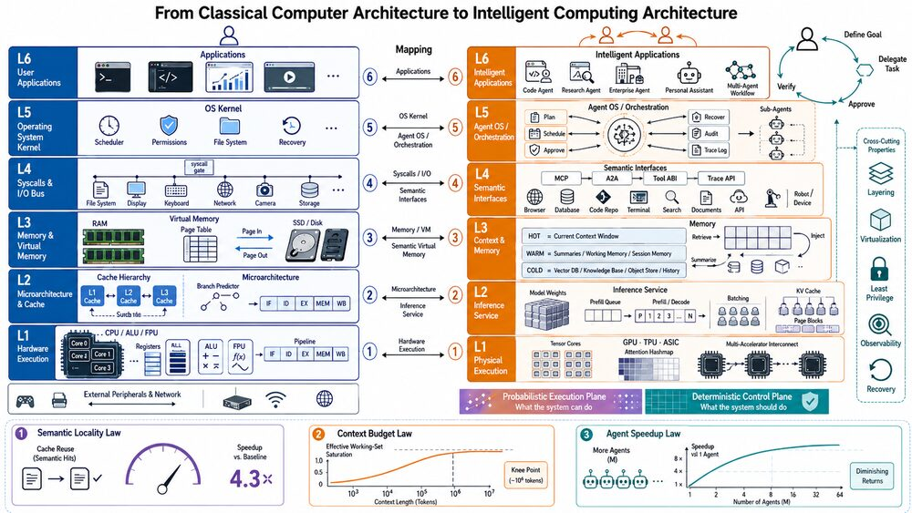
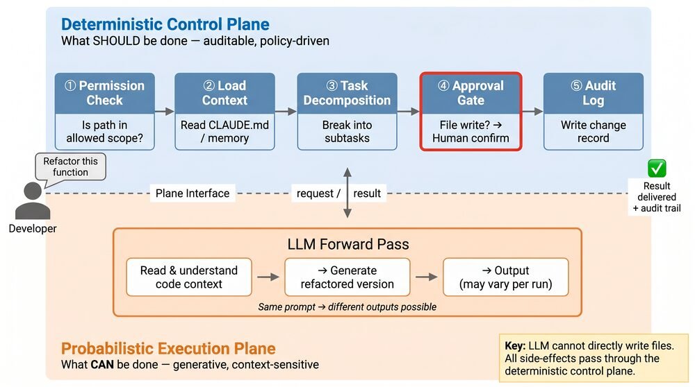
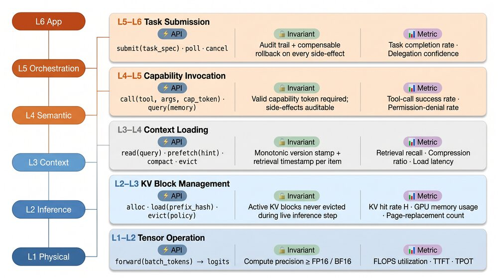
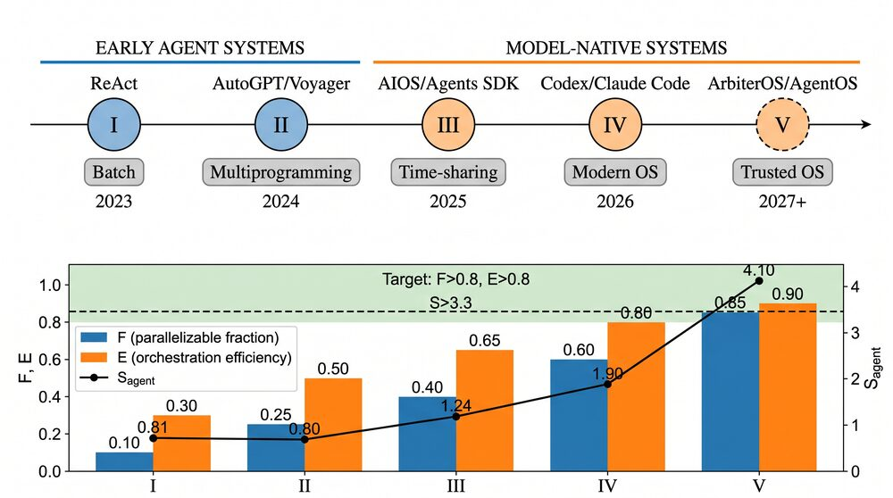
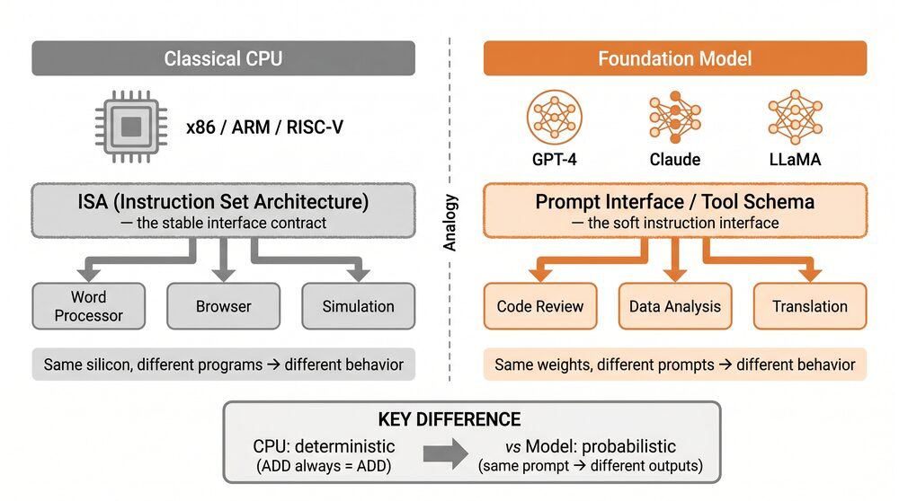
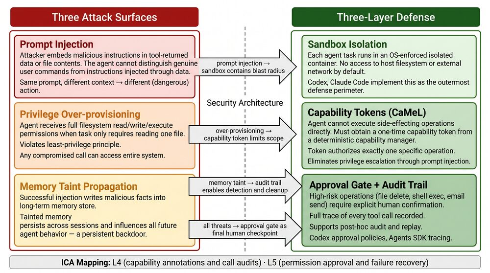
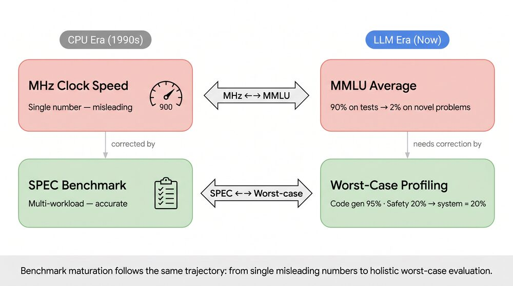
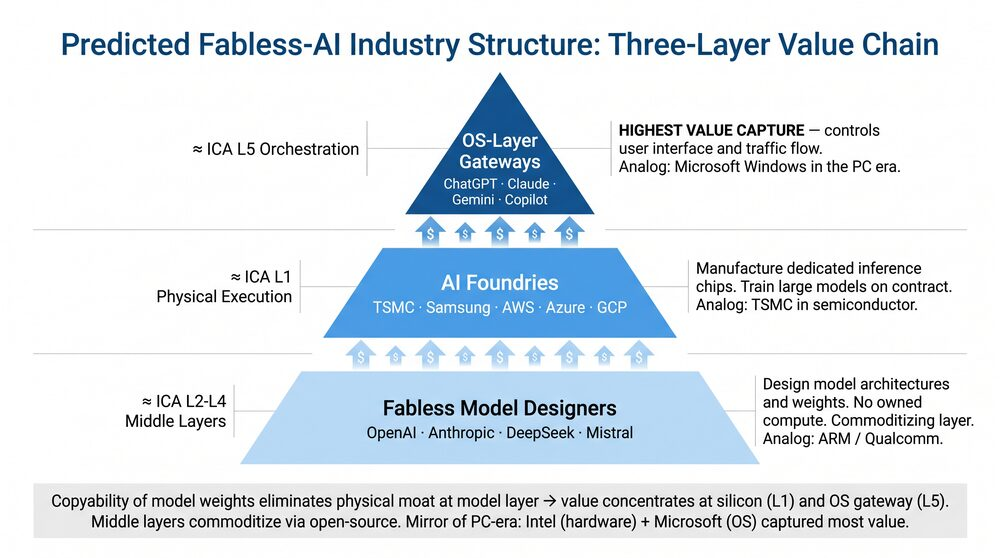
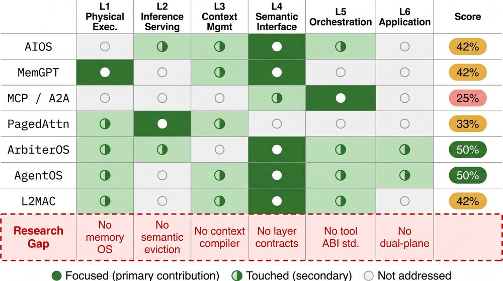

# Model-Native Computing Architecture
#### Envisioning Future System Architecture Through the Lens of Computer Architecture

> 📄 **arXiv:** <https://arxiv.org/abs/2606.00288>
>
> 📖 **Read the paper (PDF):**
> [English](https://github.com/ngyygm/llm-computer/raw/master/paper/paper_en_compressed.pdf) ·
> [中文](https://github.com/ngyygm/llm-computer/raw/master/paper/paper_zh_compressed.pdf)

**[中文版 README](README_CN.md)** · 

---

## TL;DR

Large language models are turning from a *model technology* into a *system technology*. The bottlenecks now dominating practice — cache reuse, context capacity, agent scheduling, permission control — are *systems* problems, and they look uncannily like the ones classical computer architecture solved over eight decades. **This paper treats the LLM stack as a computer and asks: can that accumulated wisdom guide how we build model-native systems?** It proposes the **Intelligent Computing Architecture (ICA)** — a six-layer model with interface contracts, design axioms, and Amdahl-style heuristics, unified by a **dual-plane** view that resolves the old "is an LLM a CPU or an OS?" debate.

## 1 · The Core Analogy

If we map the model-native stack onto a classical computer, every layer has a counterpart:

| Classical Computing | Model-Native Computing | Shared Problem |
|---------------------|------------------------|----------------|
| CPU | LLM inference core | General-purpose computation |
| Cache (L1/L2/L3) | KV cache | Hot-data reuse, memory optimization |
| Virtual memory | Context window + external memory | Finite-capacity address-space mgmt |
| Operating system | Agent runtime | Scheduling, permissions, resource mgmt |
| I/O buses (PCIe/USB) | MCP / A2A protocols | Standardized peripheral/tool integration |
| Applications & users | Agent apps & domain experts | Turning computation into solutions |

<p align="center">
  
  <br><em>The analogy is more than surface resemblance: PagedAttention literally borrows OS paging, MemGPT borrows virtual memory, MCP/A2A play the role of I/O buses.</em>
</p>

But an analogy is not a theory — "resembles" is not "is." The paper's first contribution is to delineate exactly **where the analogy holds and where it breaks** (e.g., KV cache grows with semantic sequence, not address-indexed; context "paging" is lossy summarization, not lossless).

## 2 · The Dual-Plane Architecture

Prior work split into conflicting camps — ArbiterOS calls the LLM a *"Probabilistic CPU,"* AIOS a *"kernel,"* AgentOS a *"reasoning kernel."* The paper resolves this by recognizing **two orthogonal planes**:

- **Probabilistic execution plane** — model inference and generation: *what the system CAN do.*
- **Deterministic control plane** — schedulers, approvers, audit logs: *what the system SHOULD do.*

Every layer passes through both, forming a **graded crossover around L3–L4** (not a hard cut). The competing claims are then just different cross-sections of the same two-plane system.

<p align="center">
  
  <br><em>The dual-plane architecture, mapped onto the six ICA layers.</em>
</p>

## 3 · The ICA Six-Layer Model

| Layer | Name | Classical Analogy |
|:-----:|------|-------------------|
| L1 | Model Weights & Hardware | CPU / Silicon |
| L2 | Inference & KV Cache Serving | Instruction Pipeline / Cache |
| L3 | Context & Memory Management | Virtual Memory |
| L4 | Tool & Protocol Interface | System Call / ABI |
| L5 | Agent Orchestration | Operating System |
| L6 | Workflow & Applications | User Applications |

Each pair of adjacent layers has an explicit **interface contract** (operations, invariants, metrics), and the model carries **six design axioms** (locality, layered abstraction, probabilistic execution, virtualization, least privilege, observability).

<p align="center">
  
  <br><em>The five inter-layer interface contracts of ICA.</em>
</p>

## 4 · Three Amdahl-Style Design Heuristics

Deliberately framed as back-of-envelope *heuristics* (not validated scaling laws), these transplant Amdahl's analytical form into the model-native regime:

| Heuristic | Formula | Classical Analogy |
|-----------|---------|-------------------|
| **I. Semantic Locality** | $S = \dfrac{1}{(1-H) + H \cdot \alpha^{-1}}$ | KV-cache hit rate ↔ Amdahl's Law |
| **II. Context Budget** | $W_{\text{eff}} = C \cdot \bar{\beta} \le C$ | Working-set model (Denning) |
| **III. Agent Speedup** | $S_{\text{agent}} = \dfrac{1}{(1-F) + \dfrac{F}{N \cdot E}}$ | Amdahl's Law + orchestration overhead |

They give a previously qualitative design space computable, order-of-magnitude intuition (e.g., "raising the KV hit rate from 0.5→0.8 yields ~2× speedup"; "the optimal agent count $N^\* \approx \sqrt{F/(E\rho c(1-F)^2)}$").

## 5 · Agent Framework Evolution — Five Generations

The history of agent frameworks mirrors the history of operating systems, in five generations:

| Gen | Era | Hallmark | OS Analogy |
|:---:|-----|----------|------------|
| I | 2022–23 | ReAct: Thought–Action–Observation loop | Single-task batch |
| II | 2023 | AutoGPT / Voyager: persistence & decomposition | Multiprogramming |
| III | 2023–24 | AIOS / Agents SDK: scheduling & isolation | Time-sharing |
| IV | 2024–25 | Codex / Claude Code: real-world SE, sandboxes | Modern OS |
| V | 2025– | ArbiterOS / CaMeL: governance-first, capability security | Trustworthy OS |

<p align="center">
  
  <br><em>Five generations of agent frameworks, mirroring five decades of OS maturation.</em>
</p>

## 6 · Key Components in Depth

The paper analyzes each component through the classical↔model-native lens. Two representative cases:

<p align="center">
  
  <br><em>L1 — the foundation model as a general-purpose (but <b>probabilistic</b>) execution core.</em>
</p>

<p align="center">
  
  <br><em>L2 — the emerging KV-cache hierarchy (session → prefix/shared → semantic), structurally parallel to L1/L2/L3 CPU caches.</em>
</p>

## 7 · Cross-Cutting Challenges

Five design challenges cut across the stack (latency–throughput–cost trilemma, state management, interface drift, security & privacy, governance). The dual-plane view shows, for example, that **security is primarily a runtime-structure problem and only secondarily a prompt problem**:

<p align="center">
  
  <br><em>Security & privacy mapped onto the ICA layers.</em>
</p>

## 8 · Paradigm: From Silicon to Substrate

Five decades of CPU lessons map onto the LLM/Agent trajectory — Dennard scaling and the power wall ↔ the inference "energy wall"; big.LITTLE heterogeneous cores ↔ heterogeneous model orchestration; the ISA ↔ substrate independence (the "Intelligent ISA" should let the same agent framework run on silicon GPUs, neuromorphic chips, or biological substrates). The analysis yields two architecturally significant principles: **substrate independence** and the **weakest-link principle** (a system's intelligence is bounded by its weakest capability dimension).

<p align="center">
  
  <br><em>The "MHz marketing" fallacy (clock speed ≠ performance) finds its echo in single-metric LLM benchmarks.</em>
</p>

## 9 · Socio-Technical: The Fabless AI Industry

Projecting the ICA layers onto the emerging AI industry reveals where value concentrates and where commoditization bites:

| Layer | Classical analog | Emerging AI-industry owner | Value capture |
|:-----:|------------------|----------------------------|---------------|
| L1 | Foundry + chip designer | Accelerator & foundry (GPUs/ASICs) | **High** (capital moat) |
| L2 | Microarchitecture / OEM | Serving runtimes + cloud | Commoditizing |
| L3 | Memory OEM | Memory & retrieval middleware | Integration-differentiated |
| L4 | Bus / interface standard | Open protocols (MCP, A2A) | Winner-take-most |
| L5 | OS vendor | Agent-OS gateways (Codex, Claude Code) | **Highest** — the gateway |
| L6 | Application ISV | Vertical agent apps | Long tail |

<p align="center">
  
  <br><em>The predicted disaggregation toward a "fabless AI" structure: model designers, AI foundries, and OS platforms.</em>
</p>

## 10 · How This Differs from Prior Work

| Architectural artifact | Closest prior approach | ICA (this paper) |
|------------------------|------------------------|------------------|
| Full-stack layered model | Mi et al.: modular map, no contracts | Six layers with interface contracts |
| Dual-plane separation | ArbiterOS: governance layer over a "probabilistic CPU" | Probabilistic + deterministic planes |
| Interface contracts | None (layers described informally) | Five formal contracts |
| Design axioms | None | Six transplanted axioms |
| Quantitative heuristics | None | Three Amdahl-style heuristics |

<p align="center">
  
  <br><em>No prior work covers more than a slice of the stack; ICA integrates all six layers.</em>
</p>

---

## Repository Structure

```
paper/
├── paper_en.tex / paper.tex        # English / Chinese main files
├── paper_en_compressed.pdf         # Compressed English PDF (~12 MB)
├── paper_zh_compressed.pdf         # Compressed Chinese PDF (~6 MB)
├── refs.bib                        # Shared bibliography
├── en_sections/  cn_sections/      # Per-section sources (15 each, parallel)
└── figures/                        # TikZ sources + rendered images
    ├── fig_*.tex                   # TikZ sources
    ├── *.png                       # Pre-rendered raster figures
    └── generated/                  # Generated illustration PNGs
assets/                             # Downsized figure thumbnails for this README
```

## Building

```bash
cd paper
# English
pdflatex paper_en.tex && bibtex paper_en && pdflatex paper_en.tex && pdflatex paper_en.tex
# Chinese
pdflatex paper.tex && bibtex paper && pdflatex paper.tex && pdflatex paper.tex
```

## Citation

```bibtex
@article{lin2026modelnative,
  title   = {Model-Native Computing Architecture: Envisioning Future System Architecture
             Through the Lens of Computer Architecture},
  author  = {Lin, Hai and Pao, Hoilam and Zhan, Shaoxiong and Zheng, Hai-Tao},
  year    = {2026},
  eprint  = {2606.00288},
  archivePrefix = {arXiv},
  url     = {https://arxiv.org/abs/2606.00288}
}
```

## License

For research and academic purposes.
