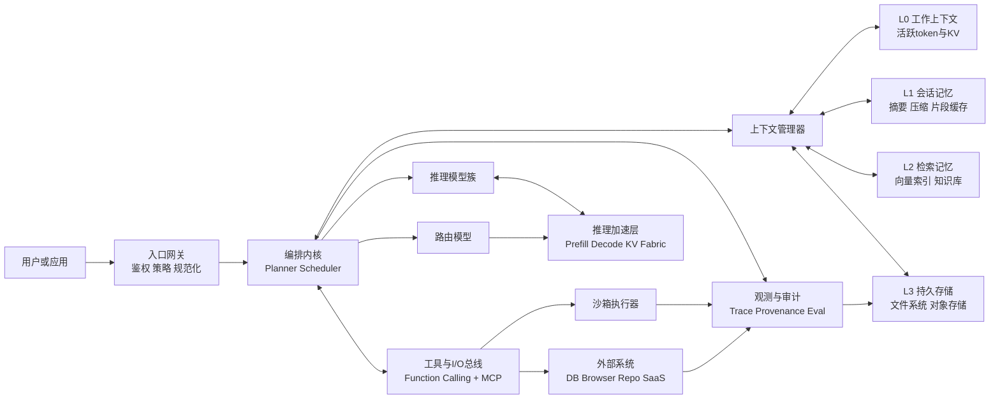

# 以计算机体系结构类比未来智能计算架构

## 执行摘要

本文把未来智能计算系统理解为一种“以大模型为执行核心、以Agent运行时为操作系统、以分层记忆与工具总线为存储/I/O层”的新型计算机。这个类比在工程组织上很有解释力，但必须同时看到三类本质差异：模型执行是概率式近似推断，不是确定性指令执行；语义记忆是检索式近似访问，不是精确寻址；现有Agent运行时仍远未达到传统操作系统的隔离、调度与容错成熟度。 citeturn6search0turn22view4turn27view5turn28view9

## 体系结构类比的基底

经典计算机体系结构可以压缩为五个关键层面：**ISA 是软硬件契约**，规定指令、寄存器、异常与可见状态；**CPU**按该契约取指、译码、执行；**操作系统**负责进程调度、内存管理、I/O 管理、文件系统与权限控制；**总线/互连**把处理器、控制器与外设连接成统一系统；**I/O**则把计算与外部世界相连。Intel 的体系结构手册把 Basic Architecture、Instruction Set Reference 与 System Programming Guide 明确区分出来；IBM 对操作系统的定义也把内核、调度器、内存管理器与 I/O 管理器列为核心部件；Arm 的 AMBA 则强调互连是管理 SoC 功能块的开放标准。 citeturn35view0turn35view5turn35view4

如果把“性能来自什么”说得更直白，那么答案通常不是单个处理器更快，而是**算力、存储层次与调度协同更好**。缓存利用时间局部性和空间局部性保存热点数据；主存提供更大但更慢的工作集；MMU 把虚拟地址翻译为物理地址，并支持隔离与保护；操作系统再通过分页、换页、调度与设备管理，使应用获得一个“看起来比物理资源更大、也更有秩序”的运行环境。这个层次化视角，正是把大模型和 Agent 放回“体系结构”语境时最有价值的出发点。 citeturn3search12turn3search1turn35view5turn35view3

## 大模型技术现状与代表工作

当前大模型的主线，已经不是单一的“参数越大越好”，而是**基础模型规模化、稀疏激活、长上下文、外部记忆、推理增强与系统级提效**并行推进。Transformer 奠定了以自注意力为核心的统一架构；GPT-3 证明了大规模自回归语言模型的少样本能力；Chinchilla 则指出了“模型参数—训练 token”应共同按计算最优缩放的规律。到近两年，开源与闭源模型已明显分化为 dense 与 MoE 两条路线：Llama 3 最大公开到 405B dense、128K context；Qwen3 同时覆盖 dense 和 MoE，参数范围从 0.6B 到 235B，并把 think / non-think 模式统一到一套框架中；DeepSeek-V3 采用 671B 总参数、每 token 激活 37B 的 MoE，并结合 MLA 与 DeepSeekMoE 面向高效推理与成本优化。 citeturn6search0turn6search1turn6search2turn22view9turn24view0turn23view0

从“参数—推理”关系看，今天的模型更像“**离线训练获得静态权重，在线推理产生动态状态**”。权重是长期固化的参数化知识，推理时真正决定时延与内存占用的，往往是动态上下文状态，尤其是 **KV cache**。Hugging Face 文档明确指出：因果注意力中，过去 token 的 K/V 可以缓存并复用；每一步只需为新 token 计算当前 K/V，并把它们追加到缓存中；这样每步不再重算全部历史 K/V。与此同时，KV cache 也会迅速成为长上下文生成的显著内存瓶颈。vLLM 的 PagedAttention 进一步把 KV 管理显式地类比为操作系统中的分页，报告在相同延迟水平下可把吞吐提高 2–4 倍。 citeturn26view0turn26view1turn27view0turn27view1

上下文窗口本身正在快速增长，并开始呈现“**工作内存**”的系统味道。Anthropic 将 context window 直接定义为模型生成时可回看和引用的 working memory；OpenAI GPT‑4.1 官方页给出 1,047,576 token 上下文；Claude 4.8/4.7/4.6 与 Sonnet 4.6 在 Claude API 等平台上已支持 1M token；DeepSeek-V4-Flash / Pro 官方文档给出 1M 上下文和最高 384K 输出；Qwen2.5 官方中文博客给出 128K；Qwen3-Coder 官方中文博客则给出原生 256K、经 YaRN 扩展到 1M。换言之，前沿工程已经把“是否能容纳更大工作集”当作一等公民，而不是仅靠参数规模堆砌能力。 citeturn36view2turn22view0turn22view1turn22view5turn21search1turn25view0

长序列处理的技术路线也已经相当清楚。Transformer‑XL 通过 segment-level recurrence 试图突破固定上下文；Longformer 通过局部+全局注意力把复杂度从二次降到线性；LongRoPE 则把 RoPE 外推到 2M token 级别。与此同时，工程系统开始把“越长的上下文”与“越强的层级记忆”结合：RAG 把参数记忆与非参数记忆结合在一起；MemGPT 明确提出 virtual context management，把有限上下文包装成层级记忆；OpenAI、Anthropic 与 DeepSeek 都已把**跨请求前缀缓存**做成官方能力，分别表现为 Prompt Caching、Prompt Caching 与上下文硬盘缓存。这说明真实系统正在从“单一上下文窗口”转向“窗口 + 检索 + 缓存 + 压缩”的复合记忆体系。 citeturn29view0turn29view1turn28view2turn27view6turn27view5turn28view8turn33view1turn33view2turn33view0

在对齐、微调与推理效率方面，代表性路线同样已经成形。InstructGPT 把监督微调与 RLHF 结合起来，展示了“小得多的对齐模型也能优于更大的未对齐底座”；Flan 说明大规模 instruction finetuning 可以提升泛化；LoRA 与 QLoRA 让参数高效微调成为工程常态；DeepSeek‑R1 则把“纯 RL 激发推理能力”推到中心舞台；Qwen3 又把 thinking budget 明确做成推理时可调资源。效率侧，FlashAttention 从 GPU 存储层次出发做 IO-aware exact attention，Speculative Decoding 利用草稿模型和并行验证加速自回归生成，GPTQ / SmoothQuant / AWQ 等后训练量化方法则面向更低比特、更低显存与更快部署。这里最值得注意的趋势不是某一招本身，而是**模型能力与系统效率已经不可分离**。 citeturn26view7turn11search5turn27view7turn27view8turn23view4turn24view0turn24view2turn27view3turn27view4turn12search0turn12search2turn12search5

## Agent运行时与操作系统功能对照

从研究原型到产品化运行时，Agent 框架已经开始承担类似操作系统的职责：组织任务、管理状态、调度工具、处理权限与观察执行痕迹。但不同框架覆盖的“系统层”深度差异极大。ReAct 更像一种最小的“推理—行动”执行范式；AutoGPT 走向持续多步工作流；OpenAI Agents SDK 明确把 orchestration、state、approvals、handoffs 与 tracing 做成代码优先运行时；Codex 与 Claude Code 则把这些能力压进面向真实代码库和终端的工程环境。与此同时，GAIA、GTA 与 GTA‑2 都表明：即使模型和框架都在进步，长流程、真工具、开放式任务的完成率仍远不接近传统软件系统的可靠度。 citeturn31view0turn31view3turn22view4turn22view2turn22view3turn29view2turn29view3turn29view4

| 功能 | 对应体系结构层 | 现状 | 局限 |
|---|---|---|---|
| 任务分解与执行循环 | 进程/线程运行时 | ReAct 提供“推理—行动”交织的最小循环；AutoGPT 面向连续代理；OpenAI Agents 以 run loop、tools、handoffs 组织工作；Codex/Claude Code 把循环落实到代码编辑、命令执行与验证。 citeturn31view0turn31view3turn30view3turn22view2turn22view3 | 仍以协作式、提示驱动式循环为主，不具备传统 OS 级确定性调度、抢占与完整资源核算。 citeturn29view4turn29view3 |
| 工具调用与系统调用 | 系统调用接口 / 设备驱动层 | OpenAI Function Calling 把工具定义为 JSON schema；MCP 把外部系统、数据源和工具标准化；Claude Code 与 Codex 都可通过 MCP 或本地工具接入外部能力。 citeturn36view0turn28view9turn30view6turn32view3 | 工具语义仍依赖自然语言理解与封装质量，错误恢复、超时、幂等与副作用控制远弱于成熟 syscall 体系。 citeturn36view0turn29view3 |
| 上下文与状态管理 | 主存 / 会话状态 | OpenAI Agents 提供 history、session、conversationId 等多种状态承载方式；Claude Code 使用 CLAUDE.md 与 auto memory；Codex 技能采用 progressive disclosure 控制上下文装载。 citeturn30view3turn30view5turn32view1 | 现有状态多是应用级拼装，而非统一地址空间；跨会话压缩、一致性与污染控制仍是经验性工程。 citeturn27view5turn22view1 |
| 多 Agent 与多任务调度 | 调度器 / 多任务系统 | OpenAI Agents 的 handoffs 和 agents-as-tools 已形成显式编排语义；Codex 支持 subagents；Claude Code 支持 multiple agents、background agents 与 agents 视图。 citeturn30view2turn32view0turn22view3turn34view1 | 真正长流程工作流仍有显著能力崖：GTA‑2 报告顶尖模型在开放工作流上仅 14.39% 成功率。 citeturn29view4 |
| 权限、隔离与人工审批 | 内核保护 / 安全监控 | Codex 默认网络关闭，并采用 OS 级沙箱与 approval policy；OpenAI Agents SDK 明确支持 approvals / guardrails；Claude Code 提供 permission modes、allowed/disallowed tools。 citeturn30view0turn32view2turn22view4turn34view1 | Claude Code 的 command hooks 以系统用户全权限执行，显示出现有 Agent 扩展面并非都具备强隔离。 citeturn34view0 |
| 可观测性与调试 | 性能监控 / 事件追踪 | OpenAI Agents SDK 默认 tracing，记录 model calls、tool calls、handoffs 与 guardrails；Claude Code 提供 debug logs；AutoGPT 提供 monitoring and analytics。 citeturn30view1turn37view0turn34view0turn31view3 | 目前多数平台仍偏开发调试，而非形成可比肩 perf / eBPF / syscall tracing 的统一、可移植观测标准。 citeturn30view1turn37view0 |
| 可复用工作流与扩展接口 | 用户态库 / 插件系统 | Codex skills 和 Claude skills 都把可复用工作流封装为标准化资源；MCP提供跨工具互操作；Codex 还可作为 MCP server 被其他运行时调用。 citeturn32view1turn20search22turn36view1turn32view3 | 扩展接口正在收敛，但尚未形成 Unix 式“稳定小接口 + 广泛兼容实现”的成熟生态。 citeturn28view9turn36view1 |

总体上，可以把 **ReAct 看成“指令级执行范式”**，把 **AutoGPT 看成“持续任务编排器”**，把 **OpenAI Agents 看成“代码优先的通用运行时”**，把 **Codex / Claude Code 看成“特定场景下逼近 OS 的工程外壳”**。但从严格体系结构意义上说，它们都还未真正达到“内核级”成熟。 citeturn31view0turn31view3turn22view4turn22view2turn22view3

## 大模型组件与计算机架构的详细映射

首先，**提示协议、tokenization 与工具 schema 更像 ABI，而不是 ISA**。ISA 的核心是精确定义且长期稳定的可执行语义；而大模型侧，token 是输入编码单元，function calling 与 MCP 则更像给模型暴露的调用约定与外部能力描述。本文倾向于把“chat template + tokenization + tool schema + MCP”理解为模型世界的 **ABI / 调用约定**：它规定输入如何封装、工具如何声明、结果如何回传；但它并不保证像 ISA 那样的严格二进制兼容与确定执行。这个判断是基于现有文档作出的分析性推断。 citeturn35view0turn36view0turn36view1turn36view2

其次，**模型推理可以类比 CPU 执行，但只在“执行循环”层面相似**。相似点在于：用户请求进入后，系统会把 token 序列送入固定架构，逐步生成输出；对解码模型来说，这很像一个稳定的“取输入—算下一步—提交输出”的流水过程。差异则更关键：CPU 执行的是 ISA 规定的离散、可验证、确定语义；Transformer 推理执行的是一个由权重参数定义的连续函数，输出服从概率分布，哪怕温度为 0 也未必完全确定。因此，把 LLM 称为“CPU”是有启发的，但更准确的说法应是：它像一个**概率式、向量化、学习得到的执行核心**。 citeturn6search0turn35view0turn36view2

再次，**KV cache 与 L1/L2 cache 的类比最强，但也最容易被误解**。相似点在于：二者都把“即将被重复访问的热点状态”保存在更快层中，以减少重复计算或重复访存。Hugging Face 文档明确说明，过去 token 的 K/V 会被缓存并在后续步复用；PagedAttention 又进一步把这种缓存管理显式地页化。差异在于：硬件 cache 通常对软件透明，由地址、相联性、替换策略和一致性协议驱动；KV cache 则是**按序列、按层、按 token 附加增长**的模型显式状态，没有通用地址匹配，也没有经典 cache coherence。它更像“由应用管理的专用工作集缓存”，而不是对任意 load/store 自动命中的通用缓存。 citeturn26view0turn26view1turn27view0turn12search7

再进一步，**上下文管理与主存/虚拟内存的类比，在系统设计上极有价值**。Anthropic 把 context window 直接称为模型的 working memory；Transformer‑XL、Longformer、LongRoPE 分别从 recurrence、稀疏注意力和位置外推角度扩展可处理工作集；MemGPT 则几乎直接把层级内存和虚拟上下文写进标题。相似点在于：当前系统都在处理“有限快内存如何承载远大于其容量的任务状态”这一问题。差异在于：虚拟内存依赖精确地址翻译与页故障机制；LLM 上下文管理更依赖检索、摘要、压缩与启发式淘汰，没有统一地址空间，也很难保证恢复的内容与原始状态逐字一致。因此，今天的长上下文系统更像**语义版虚拟内存**，而不是传统 MMU 的直接平移。 citeturn36view2turn29view0turn29view1turn28view2turn27view5turn22view0turn22view1turn22view5

**调度与多任务**则是 Agent 侧最像操作系统的一层。OpenAI Agents 的 handoffs、agents-as-tools、sessions 与 tracing，Codex 的 subagents 与 sandbox/approval，Claude Code 的 background agents、hooks 与 memory，都对应了传统 OS 中的任务拆分、任务切换、权限提升、I/O 等待与审计记录。相似点在于：都在回答“谁来干活、何时切换、何时等待外部结果、如何记录过程”。差异在于：传统 OS 的调度单位是可抢占、可计费、可隔离的线程/进程；现有 Agent 的任务单元更像**高延迟、弱隔离、协作式的用户态协程**。GTA 与 GTA‑2 的结果说明，长流程任务失败大量来自运行时而不只来自模型本身。 citeturn30view2turn30view3turn30view1turn32view0turn22view3turn30view0turn29view3turn29view4

最后，**持久记忆更像外部存储/文件系统，工具调用更像 I/O 与系统调用**。RAG 把非参数知识库作为外部记忆；Generative Agents 与 MemoryBank 探索了更接近情景记忆/长期记忆的结构；OpenAI、Anthropic 和 DeepSeek 的 prompt/prefix 缓存则像页缓存或共享前缀缓存。工具侧，OpenAI function calling、Claude Code MCP、Codex MCP server 都在把“模型请求外部能力”做成标准接口。相似点在于：这些机制都把模型从封闭计算核心，扩展为可访问外部知识、设备和服务的开放系统。差异在于：文件系统是精确字节存储，RAG 与向量记忆是近似语义检索；系统调用是严格契约，工具调用仍含自然语言歧义、网络延迟与副作用不确定性。 citeturn27view6turn10search2turn10search3turn28view8turn33view1turn33view2turn36view0turn30view6turn32view3

## 未来智能计算架构概念设计

基于以上分析，本文提出一套**分层记忆—调度内核—工具总线**的未来智能计算架构。它不把“大模型”视为整台机器，而是把它视为**执行核心之一**；真正的“智能计算机”由五个协同模块组成：**入口与策略层**负责鉴权、规范化输入与风险过滤；**编排内核**负责规划、分解、调度、重试和人工审批；**模型执行簇**由路由模型、快速响应模型、深度推理模型和多模态工具使用模型组成；**记忆层级**负责从 L0 工作上下文到 L4 持久知识的装载与淘汰；**工具与 I/O 总线**通过 function calling / MCP 连接文件、数据库、浏览器、代码执行器和业务系统。这个设计直接借鉴了 PagedAttention 的页式状态管理、MCP 的标准化接口、Prompt Caching / 硬盘缓存的跨请求复用、以及 Agents SDK 的 tracing/guardrails 思路。 citeturn27view0turn28view9turn28view8turn33view1turn33view2turn30view1turn22view4

在接口上，建议把未来系统明确拆成四类“总线/ABI”。其一是 **Context ABI**：输入 token、工具结果、摘要块、cache key、来源与时序元数据必须同构封装；其二是 **Tool ABI**：优先兼容 JSON schema 与 MCP，使工具从“prompt 技巧”升级为“系统调用层”；其三是 **Memory API**：统一 `read / prefetch / compact / evict / persist / retrieve`；其四是 **Trace API**：所有模型调用、工具调用、权限提升、失败重试与记忆写回都必须产生可追踪事件。这样做的目标，是让“模型能力、工具能力、内存能力、评测能力”不再彼此耦死。 citeturn36view0turn28view9turn30view1turn37view0

在**数据流与调度策略**上，建议采用“**先路由、再估计工作集、后选择执行深度**”的流程。请求进入后，入口层先做安全与意图分类；编排内核用轻量模型预测任务类型、上下文预算和外部工具需求；上下文管理器按 working set 原则从 L1/L2/L3 预取必要状态；若任务简单，则走快速模型和短路径；若任务复杂，则进入深度推理模型，并允许在工具调用后继续 reasoning。调度层应采取类似多级反馈队列的思想：低延迟对话走交互队列，复杂研究任务走长作业队列，批处理评测走高吞吐队列；同时配合 **prefill/decode 解耦、KV 分片、前缀缓存复用、小模型优先路由** 来降低 TTFT 与单位任务能耗。 citeturn22view1turn28view8turn33view2turn27view0turn27view3turn27view4turn36view2

在**容错与安全**上，建议把“权限与可回放”放在架构中心，而不是事后补丁。所有有副作用的工具调用都应经过 capability token、最小权限、沙箱或人工审批；所有执行痕迹必须可追踪、可评分、可重放；长流程任务采用 checkpoint 化与可恢复 session；外部工具必须声明幂等性、重试策略和回滚语义；记忆写入必须带 provenance、TTL 与污染隔离。Codex 的 OS 级沙箱与审批、Claude Code 对 hooks 风险的明确警告、OpenAI 的 tracing / trace grading，都说明这一方向已经有现实雏形，但还缺统一内核式整合。 citeturn30view0turn32view2turn34view0turn30view1turn37view0

在**可扩展性与能效**上，最值得坚持的设计原则是“**把高成本能力后置**”。不是每个请求都应进最强推理模型，也不是每个会话都应把全部语料常驻上下文。应先利用 prefix cache、session cache、摘要压缩与检索记忆减少前缀重算，再用路由模型决定是否升级到长思考模型；在算子层用 FlashAttention、量化与 speculative decoding 降低延迟；在系统层用 KV offloading / sharding 降低显存峰值。论文正式版若配图，建议补充三类图表：**堆叠柱状图**用于时延分解（prefill、decode、tool wait、retrieval）；**miss-ratio 曲线**用于显示多层记忆收益；**质量—成本—能耗帕累托散点图**用于比较不同调度策略。 citeturn26view1turn27view3turn27view4turn12search0turn12search2turn12search5

## 关键研究问题与实验验证路径

真正困难的问题不在“类比是否好看”，而在于能否把类比落成可验证的系统设计。第一类问题是**语义地址化与一致性**：未来系统能否像虚拟内存那样，为摘要、片段、向量记忆和原始文档建立统一可追踪映射，而不是只靠 prompt 拼接。第二类问题是**跨层调度**：如何把模型选择、上下文预算、KV 驻留、工具排队和人工审批统一成一套成本函数。第三类问题是**安全与隔离**：如何防止检索污染、提示注入、跨会话泄漏与工具副作用扩散。第四类问题是**可解释评测**：不仅评最终答案，还要评 trace 的正确性、工具序列合理性和记忆读写质量。 citeturn27view5turn28view9turn30view1turn37view0

实验上，建议分成**微基准、任务基准与鲁棒性基准**三层。微基准关注 TTFT、吞吐、显存峰值、KV 命中率、cache page-in/page-out 次数、工具等待占比与单位任务能耗；Anthropic 对 TTFT 的定义可直接作为响应性指标基线。任务基准则应用 GAIA 测一般助手能力，GTA / GTA‑2 测原子工具使用与开放工作流，SWE‑bench / SWE‑bench Verified 测真实软件工程闭环，CORE‑Bench 测研究型 Agent 的可复现实验能力。鲁棒性基准则通过 fault injection 人为制造 MCP server 失联、工具超时、摘要污染、检索误召回和权限拒绝，观察系统是否能退化运行、重试、回滚或请求人类介入。 citeturn36view2turn29view2turn29view3turn29view4turn28view5turn14search1turn28view6

如果把这套架构写成论文，最有说服力的消融实验应至少包含四组：一是“无层级记忆”对照“有层级记忆”，检验上下文管理是否真优于单纯加长 prompt；二是“无编排内核”对照“有编排内核”，检验长流程 success rate 是否主要依赖运行时；三是“无安全护栏”对照“有 capability + sandbox + approval”，检验副作用风险与成功率的折中；四是“强模型直出”对照“路由 + 小模型优先 + 缓存复用”，检验质量—成本—能耗帕累托是否改善。若 trace grading 参与评测，就可以把失败定位到“模型推理错、工具用错、内存取错、还是调度错”，这正是未来智能计算架构研究最需要的诊断能力。 citeturn37view0turn30view1turn30view0turn32view2

## 结论与展望

把大模型与 Agent 放回“体系结构”视角后，可以看到：未来智能计算机不会只是更大的单体模型，而会是由**执行模型、分层记忆、Agent 内核、工具/I/O 总线与安全审计层**共同构成的系统。真正的突破点，不只在参数规模，而在于记忆层次、运行时、标准接口与治理机制能否一起成熟。 citeturn24view0turn23view0turn22view4turn28view9